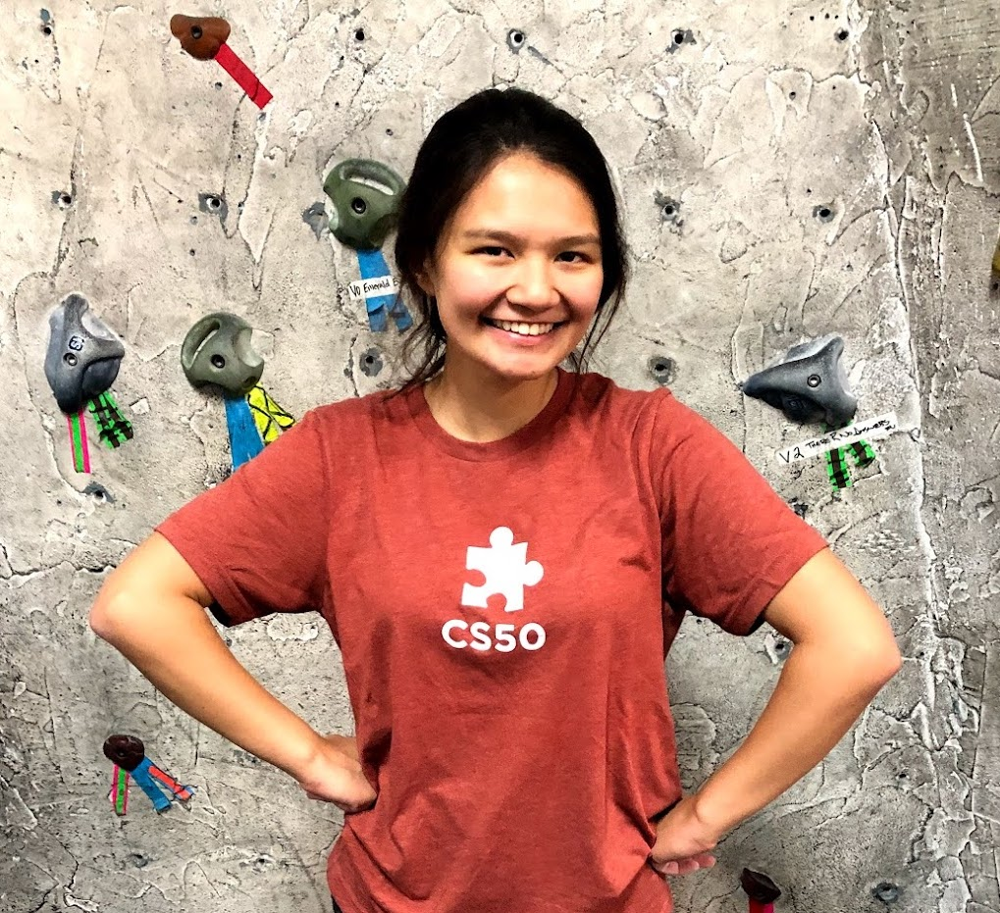

## Gillian Reyes

Hi, I'm Gia. I studied Math and Computer Science at Yale University for my undergraduate degree, and wrote my thesis on physics simulations in computer graphics. 

Currently, I am a Quantitative Strategist at Goldman Sachs. You can find my resume [here.](files/gillian_reyes_resume.pdf)

### Projects
#### A Tensor Algebraic Approach to Reduced-Order St. Venant-Kirchhoff Deformations
My thesis project mentioned above. In this project, I extended the Chaotic Blobs project below, which implemented Barbic's St. Venant Kirchoff deformations. Here, I incorporated their reduced-order Euler-Lagrange equations of motion, but approached this by using tensor algebraic internal force and stiffness matrix polynomials, as opposed to the finite element method used in their paper. The benefit to this implementation is that it makes it extensible to other deformation methods, such as the Stable Neo-Hookean method. You can find the writeup for this project [here.](files/senior_thesis.pdf) You can also access the code for this project through [my github.](https://github.com/giareyes/deformable-objects)

#### Shadow Hunters 
For our software engineering class, my friends and I turned one of our favorite board games into an [online, multi-player game](https://shadowhunters.live/). I led the front-end development for our project, creating visuals using the Phaser JS Library. I also drew all the character art! Find the code for this project [here.](https://github.com/amritrau/shadow-hunters)

#### Chaotic Blobs
Inspired by the Happy Blobs project below, I implemented Barbic and James's 2005 Paper, "Real-time subspace integration for st. venant-kirchhoff deformable models" with the addition of motion. Running this code allows you to throw the two blobs around the screen and watch them deform as they collide with walls. You can find the project [here](https://github.com/giareyes/chaotic-blobs). 

#### Happy Blobs
Created Blender Scripts with my own implementations of particle systems, L-systems, sweeping, and scripted motion. I incorporated these scripts into a [short animated clip](https://www.youtube.com/watch?v=_yVD4_2ke1Q&ab_channel=GiaDoodles).

#### Ray Tracer 
I started a C++ implementation of a [ray tracer](https://github.com/giareyes/raytracer), following along [this tutorial](https://raytracing.github.io/books/RayTracingInOneWeekend.html). I hope to add my own unique extensions soon. 

### Teaching
During my undergrad, I TA'd almost every semester for both the Math and Computer Science Departments

<b>CPSC 112: Introduction to Computer Programming</b>. Spring 2019, Spring 2020. Held a weekly session in which I would reinforce the concepts learned in class, and help them start their problem sets. I was responsible for grading my section's homework. I additionally hosted weekly office hours.

<b>CPSC 201: Introduction to Computer Science</b>. Fall 2019. Held weekly office hours, and graded homeworks and exams. 

<b>MATH 115: Calculus of Functions of One Variable II</b>. Fall 2017-Fall-2018. Held weekly office hours.

### Fun stuff
- I love running, broomball, and bouldering!
- In my free time, I like to draw and paint. 
